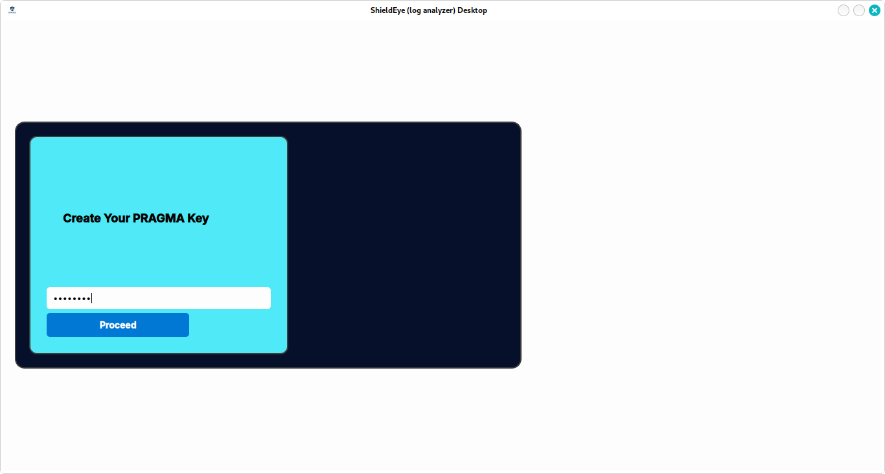
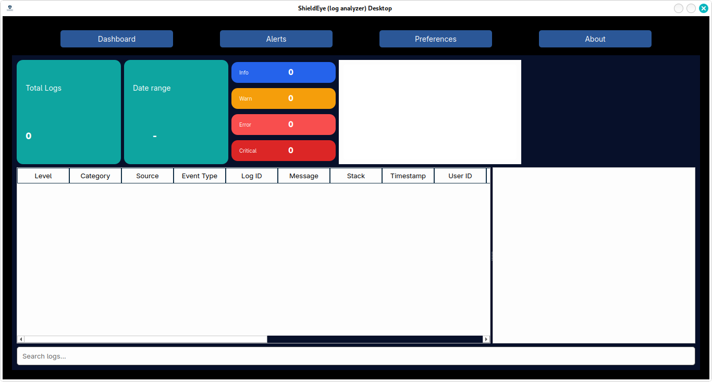
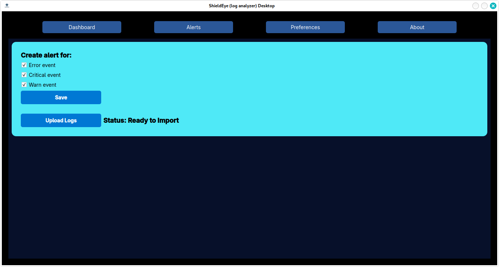
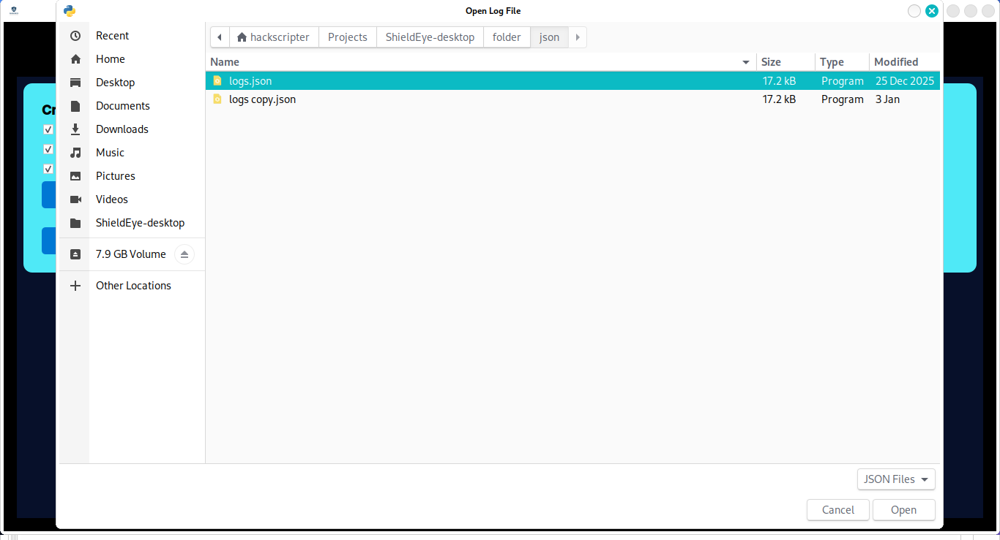
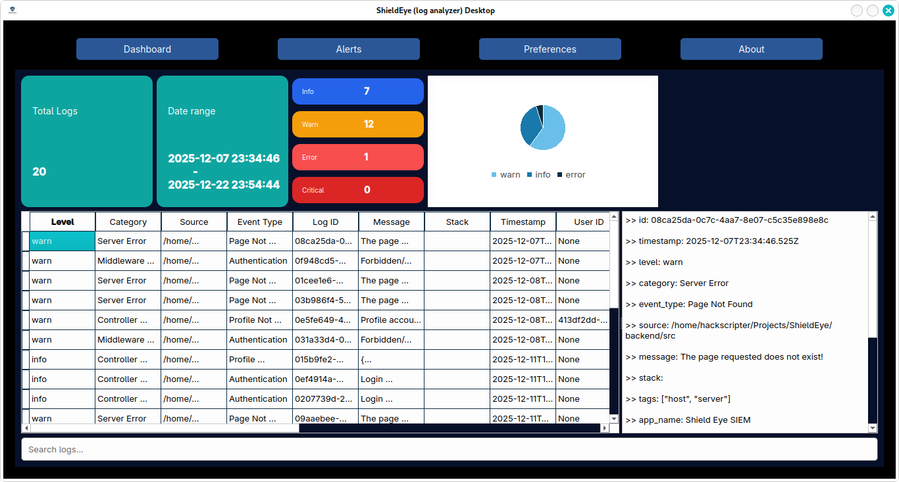
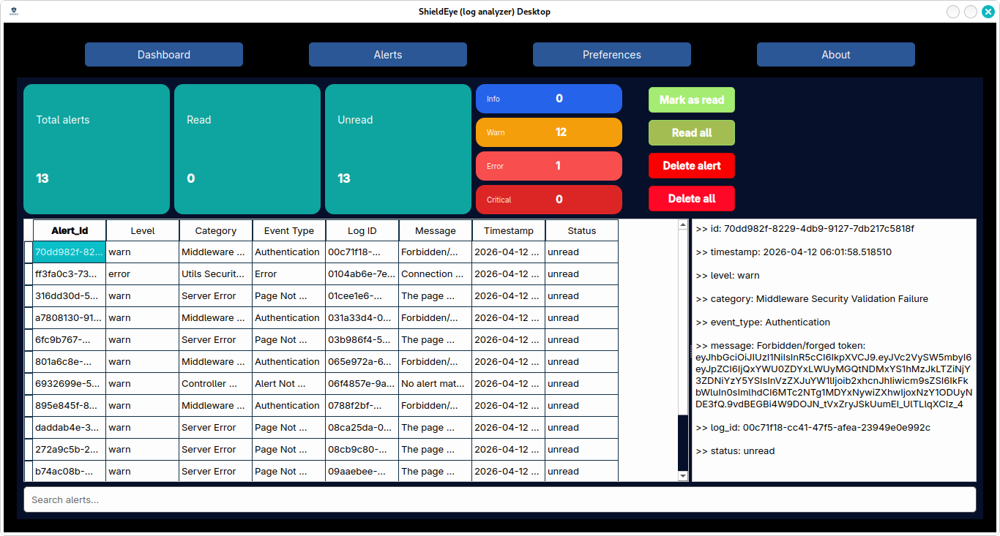
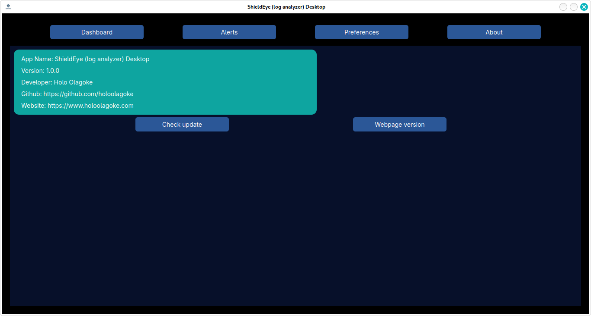

# ShieldEye Log Analyzer


ShieldEye Log Analyzer is a **manual log event collection and analysis system** designed for developers, SOC analysts, and cybersecurity professionals.  
The system allows developers to define and record meaningful application events, store them in MongoDB, and analyze them using the ShieldEye platform to detect potential security incidents.

This README serves as a **technical manual** for integrating and using the ShieldEye event logger.

[ShieldEye Documentation](https://docs.shieldeye.holoolagoke.com)

---

## Table Of Contents

- [ShieldEye Log Analyzer](#shieldeye-log-analyzer)
  - [Table Of Contents](#table-of-contents)
  - [Project Overview](#project-overview)
  - [Features](#features)
    - [Platform Capabilities](#platform-capabilities)
  - [Desktop Installation](#desktop-installation)
    - [Quick Install (Debian/Ubuntu)](#quick-install-debianubuntu)
    - [Quick Install (Windows)](#quick-install-windows)
  - [Quick Start](#quick-start)
    - [Install \& Launch](#install--launch)
    - [Export Logs from MongoDB](#export-logs-from-mongodb)
    - [Set Alert Preferences](#set-alert-preferences)
    - [Upload Logs](#upload-logs)
    - [Analyze](#analyze)
    - [More Info](#more-info)
  - [Getting Started](#getting-started)
    - [Log Event Structure](#log-event-structure)
    - [Application Metadata](#application-metadata)
    - [Network Request Context](#network-request-context)
    - [Creating Log Events](#creating-log-events)
    - [Error Logging Middleware](#error-logging-middleware)
    - [Example Usage](#example-usage)
    - [Database Connection](#database-connection)
    - [Setting Up Preferences](#setting-up-preferences)
  - [Tutorials](#tutorials)
  - [SOC Analyst Workflow](#soc-analyst-workflow)
    - [Web Platform (Detection Phase)](#web-platform-detection-phase)
    - [Investigation Phase](#investigation-phase)
    - [Desktop Platform (Forensic Analysis)](#desktop-platform-forensic-analysis)
  - [Analysis \& Usage](#analysis--usage)
  - [Architecture Philosophy](#architecture-philosophy)
  - [Open Source \& Customization](#open-source--customization)
  - [Releases](#releases)
    - [v1.0.0 — Initial Stable Release](#v100--initial-stable-release)
      - [🚀 Highlights](#-highlights)
      - [🖥️ Web Platform](#️-web-platform)
      - [💻 Desktop Platform](#-desktop-platform)
      - [🔐 Security \& Design](#-security--design)
      - [📦 Installation](#-installation)
      - [🧠 SOC Workflow Support](#-soc-workflow-support)
    - [🔮 Upcoming Releases](#-upcoming-releases)
  - [Contributing](#contributing)
  - [License](#license)
  - [Notes](#notes)
  - [Security Notice](#security-notice)
  - [Acknowledgements](#acknowledgements)
  - [Author](#author)

---

## Project Overview

ShieldEye Log Analyzer enables developers to manually create structured log events within their applications.

These events are:

- Stored in the developer’s MongoDB instance
- Read and analyzed by the ShieldEye application
- Used to identify anomalies, security threats, and abnormal behavior

Once a user signs up on ShieldEye, the platform connects to the user’s MongoDB database (read-only) and analyzes the stored logs. **ShieldEye does not store user logs on its own servers.**

---

## Features

- Manual, developer-controlled log event creation
- Structured logging for security and observability
- Multiple event types (Authentication, System, Network, Application, etc.)
- Configurable severity levels (`info`, `warn`, `error`, `critical`)
- MongoDB-based storage for scalability
- Event tagging for filtering and correlation
- Read-only log analysis through the ShieldEye platform

### Platform Capabilities

[**Web Platform**](https://shieldeye.holoolagoke.com)

> ⚠️ **Operational Status**
> The web backend is currently inactive to optimize infrastructure costs during early-stage development.
>
> The platform will resume operation when:
>
> - At least five active users are registered, or
> - A company requests a technical demonstration or project review.

- Real-time and near-real-time log analysis
- Current-month log scope for performance efficiency
- Lightweight SOC-style monitoring

[**Desktop Platform**]

- Offline log analysis
- Historical log investigation beyond the current month
- JSON log file import from MongoDB exports (mongoexport or custom export scripts)
- Designed for forensic review and long-term analysis

---

## Desktop Installation

The ShieldEye Desktop application can be downloaded from [the latest release](https://github.com/holoolagoke/shield-eye-desktop/releases/latest)

### Quick Install (Debian/Ubuntu)

```bash
sudo apt update
sudo apt install ./shieldeye_1.0.0_amd64.deb
```

### Quick Install (Windows)

Double click on the installer `shieldeye_1.0.0_setup.exe`

---

## Quick Start

### Install & Launch

Download the installer for your OS and run it.
On first launch, create a PRAGMA key (minimum 8 characters).
This key encrypts your local database — keep it safe.



on successful, the dashboard page appear with empty data



### Export Logs from MongoDB

In your MongoDB Atlas dashboard, export your `event_logs` collection as JSON using mongoexport or the Atlas UI export tool.

### Set Alert Preferences

Open the **Preferences** page, select which log levels (warn, error, critical) should trigger alerts, then click Save.



### Upload Logs

On the same Preferences page, click **Upload Logs**, and select your exported JSON file.



### Analyze

Go to the **Dashboard** to view log summaries, charts, and filter through your events.

- **Total Logs**: list total event logs in the database
- **Date Range**: show the time and date interval of the log
- **Log Level**: show how many times each log level occurred
- **Log PieChart**: Display log level in pie chart view
- **Log Table**: Display event logs in table format
- **View Pane**: Give more info about an event log
- **Search Bar**: Filter event log according to input text



Check the **Alerts** page for flagged entries based on your preferences.

- **Total Alerts**: list total alerts generated
- **Read Alert**: show number of alert read
- **Unread Alert**: show number of alert unread
- **Log Level Alert**: show the number of alert generated for each log level
- **Mark As Read**: mark selected alert as read
- **Read All**: mark all alerts as read
- **Delete Alert**: delete selected alert
- **Delete All**: delete all alerts
- **Alert Table**: Display log event alerts in table format
- **View Pane**: Give more info about the alert
- **Search Bar**: Filter alert according to input text



### More Info

Go to the **About page** to view *about the app*, *check update* or *visit the app web version*.


---

## Getting Started

### Log Event Structure

Each log event follows a consistent structure:

| Field         | Description                                           |
|---------------|-------------------------------------------------------|
| `_id`         | Unique log event identifier                           |
| `timestamp`   | Time the event occurred                               |
| `level`       | Severity level (`info`, `warn`, `error`, `critical`)  |
| `event_type`  | High-level name of the event                          |
| `category`    | Group event into defined criteria                     |
| `source`      | File or module where the event originated             |
| `message`     | Human-readable event description                      |
| `stack`       | Error stack trace (if applicable)                     |
| `tags`        | Short keywords for categorization                     |

### Application Metadata

| Field         | Description                       |
|---------------|-----------------------------------|
| `app.name`    | Name of the developer application |
| `app.version` | Application version               |

### Network Request Context

The following fields are automatically captured from the incoming request when available:

```txt
user.id
user.ip
user.method
user.endpoint
user.status
user.user_agent
```

### Creating Log Events

Create a centralized event logger file in your application.

Example Logger Implementation

```js
// shieldeye-logger.js
import { v4 as uuidv4 } from "uuid"
import clientPromise from "..."

// Connect to MongoDB
const client = await clientPromise
const db = client.db("logs")

export async function logEvent(req, res, {
    event_type,
    level = "info",
    category,
    source,
    message,
    stack = "",
    tags = []
}) {
    try {
        if (!db) return
        const collection = db.collection("event_logs")

        const log = {
            _id: uuidv4(),
            timestamp: new Date(),
            level,
            category,
            event_type,
            source,
            message,
            stack,
            app: {
                name: process.env.APP_NAME || "YourAppName",
                version: process.env.APP_VERSION || "1.0.0"
            },
            user: {
                id: req?.validatedUserId || "anonymous",
                ip: req?.ip || "0.0.0.0",
                method: req?.method || "N/A",
                endpoint: req?.originalUrl || "N/A",
                status: res?.statusCode || null,
                user_agent: req?.headers?.["user-agent"] || "N/A"
            },
            tags
        }

        return await collection.insertOne(log)
    } catch (err) {
        console.error("ShieldEye Logger Error:", err.message)
    }
}
```

### Error Logging Middleware

```js
// shieldeye-logger.js
export function errorEvent(err, req, res, next) {
    logEvent(req, res, {
        event_type: err.name || "UnhandledException",
        category: "Server Error",
        source: req?.originalUrl || "N/A",
        message: err.message,
        stack: err.stack,
        tags: ["error", "exception"]
    })
}
```

### Example Usage

```js
await logEvent(req, res, {
    event_type: "Authentication",
    level: "warn",
    category: "auth_failed",
    source: "auth func",
    message: `${username} login attempt failed`,
    tags: ["auth", "login"]
})
```

### Database Connection

Create a database named `logs`

Create a collection named `event_logs`

ShieldEye only scans the database named *logs* and the collection *event_logs*

Database User (Required):

```txt
* Create a MongoDB user named: shieldeye_agent
* Permissions: Read-only
* Restricted to: logs database and event_logs collection
* Add the ShieldEye application IP address to your MongoDB IP allowlist.
```

### Setting Up Preferences

After signing up and logging into your ShieldEye account, configure your preferences.

Required fields:

- **mongoUrl**: mongodb+srv://shieldeye_agent:<strong_password>@...
- **level**: an array of log levels to monitor when creating alerts. Example:

```json
["warn", "error", "critical"]
```

---

## Tutorials

- [How to integrate ShieldEye](./tutorials/How_to_integrate_ShieldEye.md)

---

## SOC Analyst Workflow

ShieldEye supports a practical SOC investigation workflow:

### Web Platform (Detection Phase)

- Monitor current-month logs in near real-time
- Filter by severity (`warn`, `error`, `critical`)
- Identify suspicious patterns (e.g., repeated failed logins, abnormal endpoints)

### Investigation Phase

- Export relevant logs from MongoDB
- Document observed anomalies and timelines

### Desktop Platform (Forensic Analysis)

- Import exported logs into the desktop application
- Perform deep analysis across extended time ranges
- Correlate events and reconstruct attack patterns

This workflow aligns with real-world SOC operations, balancing **performance (web)** and **depth (desktop)**.

---

## Analysis & Usage

Logs are collected directly from the user’s MongoDB instance. ShieldEye analyzes these logs for anomalies and security patterns.

Logs can be filtered by:

- event_type
- level
- category
- tags
- Date
- Word search

Regular review is recommended to detect abnormal behavior early

Best Practices

- Use clear and descriptive message values
- Apply consistent category naming
- Use lowercase tags for consistency
- Avoid logging sensitive data (passwords, tokens, secrets, PII)
- Archive or rotate old logs to prevent database bloat

---

## Architecture Philosophy

ShieldEye follows a **separation-of-concerns** approach:

- The [**web platform**](https://shieldeye.holoolagoke.com) focuses on lightweight, current-month detection and monitoring.
- The [**desktop platform**](https://github.com/holoolagoke/shield-eye-desktop/releases/latest) focuses on deep-dive, offline, and historical forensic analysis.
- This hybrid approach mirrors real-world security architectures where **hot data (recent logs)** is separated from **cold data (archived logs)** to optimize performance and investigation depth.

This design ensures scalability, performance efficiency, and analyst flexibility.

---

## Open Source & Customization

ShieldEye is designed to be extensible.

Interested users may:

- Explore and modify the full source code available in this repository
- Customize detection logic
- Implement additional correlation rules
- Modify UI or backend logic for enterprise use
- Extend logging schema to match internal security standards

Developers are encouraged to fork the repository and adapt the platform to meet organizational or research needs.

For upgrade strategies and architectural extension ideas, review the codebase structure and desktop import modules.

---

## Releases

ShieldEye follows a structured release approach to track feature updates, improvements, and platform changes.

### v1.0.0 — Initial Stable Release

**Release Date:** 2026-04-19

This release introduces the core functionality of ShieldEye as a hybrid log analysis platform.

#### 🚀 Highlights

- Web-based log analysis platform (current-month monitoring)
- Desktop application for offline and historical log analysis
- Structured logging system for developer-controlled event tracking
- MongoDB integration with read-only access model
- SOC-oriented log filtering and investigation workflow

#### 🖥️ Web Platform

- Real-time and near real-time log monitoring
- Current-month log scope for performance efficiency
- Lightweight detection-focused analysis

> ⚠️ The web backend is currently inactive and will resume based on user demand or technical demonstration requests.

#### 💻 Desktop Platform

- Import JSON logs exported from MongoDB
- Perform historical and forensic log analysis
- Designed for deep investigation without performance constraints

#### 🔐 Security & Design

- No log storage on ShieldEye servers (user-controlled data model)
- Read-only database access using `shieldeye_agent`
- Encourages secure logging practices (no sensitive data)

#### 📦 Installation

- [Download](https://github.com/holoolagoke/shield-eye-desktop/releases/latest) the latest version for your OS and
- Follow [installation](./DESKTOP_INSTALLATION.md) process for your OS

#### 🧠 SOC Workflow Support

- Detection → Investigation → Forensic Analysis workflow
- Separation of real-time monitoring (web) and deep analysis (desktop)

---

### 🔮 Upcoming Releases

Planned enhancements include:

- Advanced correlation rules for threat detection
- Timeline-based log visualization
- Export and reporting capabilities
- Enhanced filtering and search performance
- Potential reactivation and scaling of the web platform

---

For full release artifacts and downloads, refer to the [Release](https://github.com/holoolagoke/shield-eye-desktop/releases/latest) in this repository.

---

## Contributing

- Fork the repo
- Create a feature branch
- Submit a pull request with a clear description
- Follow existing code style
- Do not commit sensitive data or credentials

Future enhancements include:

- Advanced correlation rules
- Timeline-based investigations
- Extended export and reporting features

Contributions, design feedback, and security reviews are welcome.

---

## License

This project is licensed under the MIT License.

© Holo Olagoke

---

## Notes

- Logs are not stored on ShieldEye servers. If logs are deleted from your MongoDB instance, they cannot be recovered.
- Only provide MongoDB URLs created with the shieldeye_agent read-only user.
- The ShieldEye web version analyzes logs generated within the current calendar month only (Day 1 – Day 31), at the start of each new month, ShieldEye begins analysis on newly generated logs.
- Investigation of historical logs beyond the current month is not supported in the web version.
- Investigators or developers are encouraged to jot down unusual patterns or export their logs from MongoDB if they want to preserve historical data for offline analysis.
- A desktop version of ShieldEye is available and supports long-term log retention and historical forensic analysis.
- Since logs are stored in the user’s MongoDB instance, they can be exported and uploaded into the ShieldEye Desktop application.
- The desktop version enables investigations beyond the current month without impacting web platform performance.

---

## Security Notice

- Developers are responsible for ensuring that sensitive information is never logged.
- ShieldEye does not sanitize or redact logs at the source.

---

## Acknowledgements

This project is supported by continuous learning and professional guidance from the cybersecurity and software engineering community.

Special acknowledgment is given to:

- **[Steven - MyDFIR](https://www.youtube.com/@MyDFIR)**  
For practical SOC-focused training, detection engineering concepts, and real-world defensive security knowledge that influenced Shield Eye’s log analysis and investigation design.

- **[Dave Gray](https://www.youtube.com/@DaveGrayTeachesCode)**  
For foundational and advanced full stack software engineering knowledge that contributed to the architectural design, scalability considerations, and implementation approach of this project.

Their educational content significantly contributed to the skills and knowledge applied in the development of ShieldEye.

---

## Author

Name: Holo Olagoke Friday  
Career path: Cybersecurity & Software Engineering  
Website: [www.holoolagoke.com](https://www.holoolagoke.com)  
Contact: [contact@holoolagoke.com](mailto:contact@holoolagoke.com)

---
